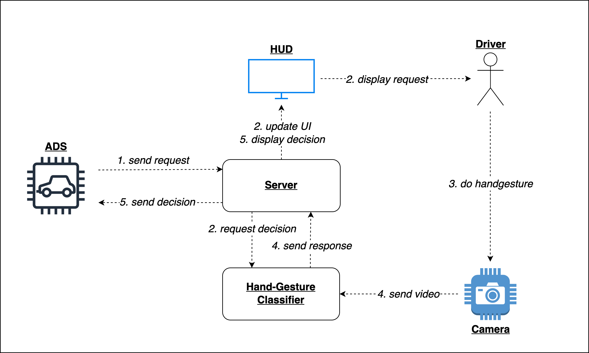

# driver-hci

[COOP-Driving](https://www.coop-driving.com/) provides a framework for expanding an existing ADS with human-computer interaction using a binary decision model. For the interaction processes it makes use of handgesture-recognition using computer vision. Information about the ADS and user interaction is displayed on a lightweight UI.

For further information about the project visit [coop-driving.com](https://www.coop-driving.com/)!

## Component overview

The different components communicate remotely via network sockets. An incoming request from the ADS triggers the logic displayed in the following figure:



## Installing dependencies

Before configuring the components you need to install the necessary modules. Depending on your setup, the installation process of the individual modules may differ. For pyTorch, please refer to this [link](https://pytorch.org/get-started/locally/). 


TODO: add torch version and details about install

Using `pip` you can install the remaining dependencies by running the following command:

```s
pip3 install -r requirements.txt
```

### UI

An up-to-date `node` version is needed. Therefore it is recommended to use `nvm` to manage node versions. You can install `nvm` by following the guide on their [github](https://github.com/nvm-sh/nvm).

Then run the following commands:

```s
nvm install 19.4.0
nvm use 19.4.0
```

Afterwards, navigate to `user_interface` and install the necessary node modules:

```s
cd user_interface
npm install 
```

If everything worked as expected, you should be able to start the application by calling:

```s
npm run app:dev
```

## Configuration

To configure the components you need to open `config.ini` and modify the following lines:

```s
HOST = 192.168.0.0 # IPv4 
HOST_REQUEST_PORT = 40000 
HOST_RESPONSE_PORT = 40001 
```

Replace the value of `HOST` with the IPv4 address from the machine where `server.py`is running. You can also replace the ports where the script should listen for requests/responses.

Next you should configure `config.ini` to point to the address of the webserver which listens for HTTP POST requests on the address given in the following line: 

```s
WEBSERVER_ADDRESS = http://192.168.0.0:40002/login 
```

## Starting the components

You want to make sure that every component is available to receive and send data over the network using UDP and for the webserver to accept HTTP POST requests over TCP. Make sure that your firewall allows network traffic to pass through the defined ports.

### Main Server

This component is in control of the main logic and the intercommunication between machines. You can launch it by calling:

```s
python3 server.py
```

### Webserver/UI

The webserver uses [node.js](https://nodejs.org/en/) to handle HTTP traffic. You can launch the server by executing the following lines:

```s
cd user_interface
npm run app:dev
```

### Handgesture Recogntion

To start the hand gesture recognition:

```s
cd handgesture/Minimal-Codebase
python3 z_execute.py
```

You can configure the input for the CV-classifier in the file `handgesture/Minimal-Codebase/config.json`. If you want to use a camera for live recognition you want to change the following line:

```s
...
"camera_port": "https://192.168.0.0:8080/video",
...
```

And replace the value of `camera_port` with the stream-address of your networking-ready camera.

## Testing the Setup

Make sure all processes access the same configuration file, namely `config.ini`.

In order to verify the network communication and the presence of each component, you can launch the test script provided in `test.py`. In this file you can comment/uncomment logic to test requests and responses. Also, as there is no actual ADS in place yet, you can simulate requests from the ADS by calling:

```s
python3 test.py
```